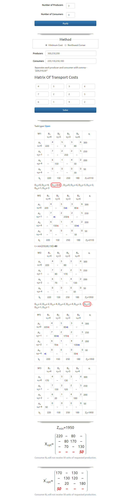

# Transportation Problem

The transportation problem is a linear programming problem where the objective is to minimise the cost of distributing a product from a number of sources or origins to a number of destinations.

Транспортната задача е задача в линейното програмиране. Целта ѝ е да намери такава транспортна програма, която при минимални транспортни разходи да разпредели дадена продукция от няколко източника до различни дестинации.

#### Site
  - http://transport-task.tk

### Picture of the calculations

  